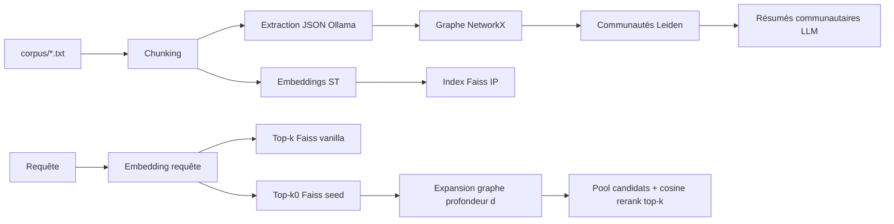

# GraphRAG MVP (style Microsoft)

Pipeline **reproductible** : découpage du corpus, extraction structurée JSON via **Ollama Cloud** (`gpt-oss:120b`), graphe **NetworkX**, communautés **Leiden** (`python-igraph`), synthèses communautaires (LLM ou mode hors-ligne), embeddings **sentence-transformers** + **Faiss** (cosine via vecteurs normalisés), retrieval **hybride** (amorçage Faiss + expansion d’entités + re-classement cosine vs baseline Faiss seul).

## Architecture



- **Baseline** : mêmes chunks, même encodeur, **Faiss seul** sur tout l’index.
- **GraphRAG** : mêmes embeddings, mais candidats = graines Faiss + chunks reliés aux entités à distance ≤ `GRAPH_MAX_DEPTH`, puis **tri par similarité cosine** sur le sous-ensemble (plafonné par `GRAPH_MAX_EXTRA_CHUNKS`).

## Prérequis

- Python **≥ 3.10**
- Clé API Ollama (Bearer) pour l’extraction et les résumés LLM : [clés Ollama](https://ollama.com/settings/keys)

## Installation

```bash
cd 02-graphrag-from-scratch
python3 -m venv .venv
source .venv/bin/activate   # Windows: .venv\Scripts\activate
pip install -e ".[dev]"
```

## Variables d’environnement

| Variable | Rôle | Défaut |
|----------|------|--------|
| `OLLAMA_HOST` | Hôte API | `https://ollama.com` |
| `OLLAMA_API_KEY` | Bearer (obligatoire pour extraction LLM) | — |
| `OLLAMA_MODEL` | Modèle chat | `gpt-oss:120b` |
| `EMBED_MODEL` | sentence-transformers | `sentence-transformers/all-MiniLM-L6-v2` |
| `CHUNK_SIZE` / `CHUNK_OVERLAP` | Fenêtre caractères | `420` / `90` |
| `FAISS_SEED_K` | K pour amorçage graphe | `6` |
| `GRAPH_MAX_DEPTH` | Profondeur BFS entités | `2` |
| `GRAPH_MAX_EXTRA_CHUNKS` | Budget de nouveaux chunks hors graine | `24` |
| `LEIDEN_RESOLUTION` | Résolution Leiden | `1.0` |
| `GRAPHRAG_MOCK_LLM` | `1` = extraction heuristique sans Ollama | `0` |

## Commandes

Indexer (LLM réel) :

```bash
export OLLAMA_API_KEY=...
python -m graphrag_mvp.pipeline --corpus corpus --out artifacts
```

Indexer **sans** Ollama (heuristique + résumés factices) — utile pour CI / démo locale :

```bash
python -m graphrag_mvp.pipeline --corpus corpus --out artifacts --heuristic
```

Évaluation offline (recall@k, MRR) :

```bash
python -m graphrag_mvp.evaluate --artifacts artifacts --qa eval/qa_labeled.json --out metrics.json
```

Tests unitaires :

```bash
pytest -q
```

Entrées CLI équivalentes : `graphrag-index`, `graphrag-eval` après `pip install -e .`.

## Corpus toy

Cinq fichiers texte fictifs sur **Acme Robotics** (`corpus/`) avec entités réutilisées (Meridian, Nexus-400, Orbit, VEX, incidents).

## Jeu de questions

`eval/qa_labeled.json` : champs `gold_substrings`, `gold_match` = `"all"` (toutes les chaînes dans le même chunk) ou `"any"`.  
Recall@k = moyenne des \( |gold \cap top_k| / |gold| \) par question (si `gold` vide → 0).

## Résultats (extrait)

Rapport complet : [`metrics.json`](metrics.json) (généré après `evaluate`). Exemple **heuristique** sur ce corpus (mêmes scores ici car le re-classement cosine sur le pool élargi reproduit souvent l’ordre Faiss sur un micro-corpus dense) :

| Méthode | MRR | R@1 | R@3 | R@5 | R@10 |
|---------|-----|-----|-----|-----|------|
| Vanilla Faiss | 0.91 | 0.67 | 0.89 | 0.89 | 1.0 |
| Hybrid GraphRAG | 0.91 | 0.67 | 0.89 | 0.89 | 1.0 |

Les deux approches divergent dès que des chunks pertinents ont une **similarité initiale basse** mais sont reliés aux graines par le graphe ; sur ce jeu, la difficulté apparaît surtout pour `q_meridian_stack` (premier hit rang **6** pour les deux — voir `per_question` dans `metrics.json`).

## Si recall GraphRAG ≤ vanilla

1. **Graines trop petites** : augmenter `FAISS_SEED_K`.
2. **Ponts manquants** : qualité d’extraction (prompt JSON, schéma Ollama) ou `GRAPH_MAX_DEPTH` trop faible.
3. **Trop de bruit dans le pool** : réduire `GRAPH_MAX_EXTRA_CHUNKS` ou affiner l’heuristique / le modèle d’extraction.
4. **Communautés trop fragmentées** : baisser `LEIDEN_RESOLUTION` pour fusionner des entités liées.
5. **Embeddings** : modèle `EMBED_MODEL` plus adapté au domaine.

Le script d’éval remplit `diagnosis` dans `metrics.json` avec un rappel de ces leviers.

## Neo4j (optionnel)

Le MVP reste **NetworkX** + JSON. Pour passer à une base graphe persistée :

```bash
docker compose -f docker-compose.neo4j.yml up -d
```

Bolt : `bolt://localhost:7687`, utilisateur `neo4j` / mot de passe `graphragdev`.  
L’ingestion Neo4j n’est pas codée ici (greffon possible à partir de `artifacts/graph.json`).

## Fichiers produits (`artifacts/`)

- `chunks.jsonl` — chunks + extractions
- `graph.json` — graphe sérialisé (nœuds / arêtes)
- `chunk_to_entities.json`, `entity_to_chunks.json`
- `partition.json`, `communities.json`, `community_reports.json`
- `faiss.index`, `embeddings.npy`, `chunk_order.json`, `manifest.json`, `build_meta.json`

Ne pas versionner `artifacts/` en entier si le binaire Faiss / les embeddings sont lourds ; garder `metrics.json` à la racine comme rapport.

Les fichiers `community_reports.json` (résumés Leiden + éventuelle méta-couche) servent la voie **globale** type GraphRAG complet ; l’évaluation fournie mesure surtout le chemin **local** chunks + expansion graphe (les résumés peuvent être branchés sur une deuxième indexation embedding en extension).
